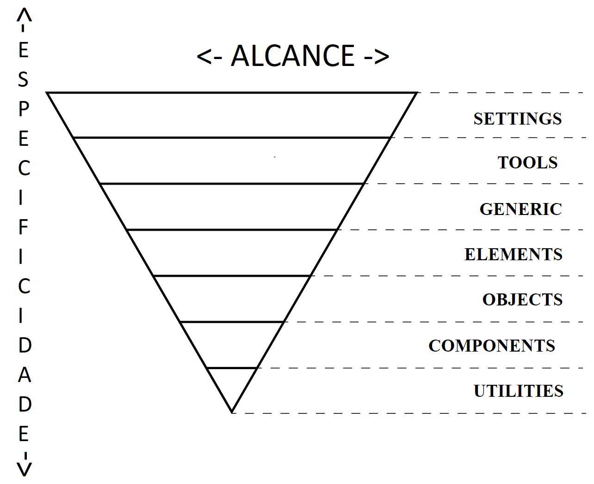

# Modulos de estilos

Este diretorio armazena todos os fontes SASS do projeto, com exceção dos correspondentes aos componentes Angular.

Práticas adotadas:

- [ITCSS](https://www.xfive.co/blog/itcss-scalable-maintainable-css-architecture/): [settings](./settings/README.md), [tools](./tools/README.md), [generic](./generic/README.md), [elements](./elements/README.md), [objects](./objects/README.md), [components](./components/README.md) e [utilities](./utilities/README.md);
- [BEM](http://getbem.com/introduction/): Apenas no nível [objects](./objects/README.md) e nos componentes Angular;
- [AtomicCSS/FunctionalCSS](https://css-tricks.com/lets-define-exactly-atomic-css/): apenas no nível [utilities](./utilities/README.md);

Como consequência em se utilizar ITCSS e BEM, podemos dizer que a prática conhecida como [BEMIT](https://csswizardry.com/2015/08/bemit-taking-the-bem-naming-convention-a-step-further/), que engloba as duas, é utilizada por este projeto.
Algumas caracteristicas de cada uma das práticas são ignoradas por não serem relevantes para nosso modelo de desenvolvimento.

O que não seguimos?

- BEM: Como o maior escopo de CSS possível permitido é o proporcionado por um `block` (`B` do acrônimo `BEM`), a prática não recomenda o uso de resets e normalizers, ou seja, nao incentiva o uso de frameworks css como o metronic. Nós utilizamos frameworks e normalizers neste projeto, então existem desde regras CSS com alcance maior que um bloco BEM, até fontes que nem seguem o padrão BEM.
- AtomicCSS/FunctionalCSS: Só é utilizado em casos onde favorece o [DRY](https://deviq.com/don-t-repeat-yourself/), possibilitando o reuso através de classes funcionais.

Representação gráfica do ITCSS: Cada camada inferior pode utiliziar elementos da camada superior, porém camadas superiores não devem ter nenhum tipo de referência às camadas inferiores. Em outras palavras, a direção de dependência segue de cima para baixo.

